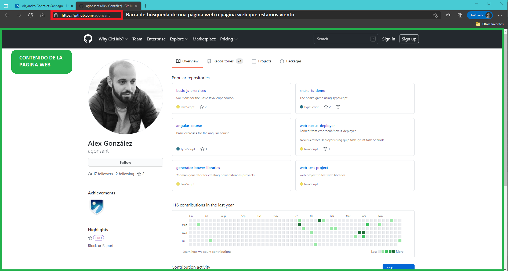
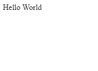
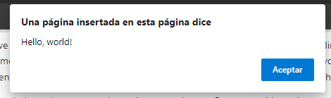

# Build Grocery List Web App

Un tutorial sobre cómo crear una web paso a paso para gestionar la lista de la compra

## Introducción al desarrollo web

Antes de empezar a construir la web, necesitamos tener algun conocimiento de lo que estamos haciendo.

Si ya sabes lo que es HTML, CSS y JavaScript puedes empezar desde aquí.

### ¿Que es una web?

Una página web es una forma de publicar información o interactuar con una empresa en internet y permite que sus usuarios puedan verla y consumirla desde cualquier dispositivo que se encuentre conectado a internet.

Para que un usuario pueda ver una web necesita tener instalada la aplicación que es capaz de interpretarla, el archi-conocido NAVEGADOR. Existen muchos navegadores en el mercado aunque los más conocidos y actuales son: [Microsoft Edge](https://www.microsoft.com/es-es/edge?r=1), [Google Chrome](https://www.google.com/intl/es/chrome/), [Mozilla Firefox](https://www.mozilla.org/es-ES/firefox/new/) y [Safari](https://www.apple.com/es/safari/).

En la siguiente imagen tenemos un ejemplo de mi perfil de Github ejecutandose en un navegador.



### ¿Como se construye una web?

Si bajamos un poquito a detalle una web son un conjunto de archivos o documentos, como un word, un pdf u otro tipo de documento, escritos en "idiomas" que el navegador es capaz de entender y procesar:

- [HTML](https://es.wikipedia.org/wiki/HTML): Es el que nos permite definir los contenidos y la estructura de una página web (títulos, párrafos, imagenes, enlaces, botones, etc). Son archivos con extensión `.html`.

Este sería un ejemplo de HTML que muestra un párrafo que pone hola mundo.

```HTML
<html>
 <head>
 </head>
 <body>
   <p>Hello World<p>
 </body>
</html>
```

El resultado al verlo en un navegador sería:



- [CSS](https://es.wikipedia.org/wiki/Hoja_de_estilos_en_cascada): Es el que nos permite dar una forma de presentación a los contenidos creados en HTML (colores, tamaños, posición en la página, etc). Son archivos con extensión `.css`. Para poder utilizar un archivo CSS hay que indicarlo en el documento HTML asociado.

Este sería un ejemplo de CSS para poner el color de todos los párrafos en rojo.

```CSS
p {
  color: red;
}
```

Si lo enlazamos en el HTML del ejemplo anterior (lo veremos más adelante), se visualizaría de la siguiente manera.


- [JavaScript](https://es.wikipedia.org/wiki/JavaScript): Es un lenguaje de programación que, cuando se ejecuta en un navegador, nos permite gestionar las acciones del usuario con la web (Cuando un usario hace click a un elemento, cuando quiere cambiar a otra página, etc). Son archivos con extensión `.js`. Para poder utilizar un archivo JS en un navegador, hay que indicarlo en el documento HTML asociado.

Este sería un ejemplo de JS que lance una alerta al usuario que pone Hola mundo.

```JS
alert( 'Hello, world!' );
```

Si lo enlazamos en el HTML del ejemplo anterior (lo veremos más adelante), se visualizaría de la siguiente manera.



#### Similitud de una web con el mundo real

Por poner un ejemplo de similitud con el mundo real y asi poder entender mejor los diferentes elementos para construir una web, podríamos pensar en una casa.

Para construir una casa vamos a necesitar materiales (ladrillos, ventanas, suelo, cama, escritorio, etc). Esto es lo que sería el `HTML` en una página web.

Solo por tener estos materiales no tendríamos una casa, necesitamos indicar el tamaño y color de nuestras paredes, decidir en que posición de la casa ponemos la cama o el sofá. Esto vendría lo que haría el `CSS` en una página web.

Por ultimo una vez que la hemos constuido, interactuamos con ella (llamar al timbre, abrir una puerta, abrir el grifo). Todas esas acciones son las que gestionariamos utilizando `JavaScript` en una Web.

### ¿Que ocurre cuando un usuario solicita una página web a un navegador?

Una vez que construimos una web, la tenemos que publicar en internet para que cualquiera con conexión pueda acceder utilizando su navegador.

Para ello la persona responsable de esa web guarda los archivos en lo que se conoce como Servidor, un ordenador con el cual me puedo comunicar a utilizando internet.

Igual que las personas utilizamos un idioma para comunicarnos, para que el navegador pueda solicitar al servidor descargar el archivo HTML que da inicio a la página web, este utiliza un idioma que conocen ellos.

A este idioma o protocolo se le conoce como HTTP, protocolo de transferencia de hiper-texto en una red.

Estos sería lo que ocurre, de manera muy simplificada, cuando le pedimos al navegador que nos muestre una página web:


## Prerequisitos para el tutorial

### Instalar un IDE

## Construir una Web de lista de la compra

### Diseño de la Web

### Creando la estructura de la página

### Estilizando con CSS

### Interactuando con el usuario


