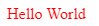

# Build Grocery List Web App

Un tutorial sobre cómo crear una web paso a paso para gestionar la lista de la compra.

## Introducción al desarrollo web

Antes de empezar a construir la web, necesitamos tener algun conocimiento de lo que estamos haciendo.

Si ya sabes lo que es HTML, CSS y JavaScript puedes empezar desde aquí.

### ¿Qué es una web?

Una página web es una forma de publicar información o interactuar con una empresa en internet y permite que sus usuarios puedan verla y consumirla desde cualquier dispositivo que se encuentre conectado a internet.

Para que un usuario pueda ver una web necesita tener instalada la aplicación que es capaz de interpretarla, el archi-conocido NAVEGADOR. Existen muchos navegadores en el mercado aunque los más conocidos y actuales son: [Microsoft Edge](https://www.microsoft.com/es-es/edge?r=1), [Google Chrome](https://www.google.com/intl/es/chrome/), [Mozilla Firefox](https://www.mozilla.org/es-ES/firefox/new/) y [Safari](https://www.apple.com/es/safari/).

En la siguiente imagen tenemos un ejemplo de mi perfil de Github ejecutandose en un navegador.


### ¿Cómo se construye una web?

Si bajamos un poquito a detalle una web son un conjunto de archivos o documentos, como un word, un pdf u otro tipo de documento, escritos en "idiomas" que el navegador es capaz de entender y procesar:

- [HTML](https://es.wikipedia.org/wiki/HTML): Es el que nos permite definir los contenidos y la estructura de una página web (títulos, párrafos, imagenes, enlaces, botones, etc). Son archivos con extensión `.html`.

Este sería un ejemplo de HTML que muestra un párrafo que pone hola mundo.

```HTML
<html>
 <head>
 </head>
 <body>
   <p>Hello World<p>
 </body>
</html>
```

El resultado al verlo en un navegador sería:


- [CSS](https://es.wikipedia.org/wiki/Hoja_de_estilos_en_cascada): Es el que nos permite dar una forma de presentación a los contenidos creados en HTML (colores, tamaños, posición en la página, etc). Son archivos con extensión `.css`. Para poder utilizar un archivo CSS hay que indicarlo en el documento HTML asociado.

Este sería un ejemplo de CSS para poner el color de todos los párrafos en rojo.

```CSS
p {
  color: red;
}
```

Si lo enlazamos en el HTML del ejemplo anterior (lo veremos más adelante), se visualizaría de la siguiente manera.



- [JavaScript](https://es.wikipedia.org/wiki/JavaScript): Es un lenguaje de programación que, cuando se ejecuta en un navegador, nos permite gestionar las acciones del usuario con la web (Cuando un usario hace click a un elemento, cuando quiere cambiar a otra página, etc). Son archivos con extensión `.js`. Para poder utilizar un archivo JS en un navegador, hay que indicarlo en el documento HTML asociado.

Este sería un ejemplo de JS que lance una alerta al usuario que pone Hola mundo.

```JS
alert( 'Hello, world!' );
```

Si lo enlazamos en el HTML del ejemplo anterior (lo veremos más adelante), se visualizaría de la siguiente manera.


#### Similitud de una web con el mundo real

Por poner un ejemplo de similitud con el mundo real y asi poder entender mejor los diferentes elementos para construir una web, podríamos pensar en una casa.

Para construir una casa vamos a necesitar materiales (ladrillos, ventanas, suelo, cama, escritorio, etc). Esto es lo que sería el `HTML` en una página web.

Solo por tener estos materiales no tendríamos una casa, necesitamos indicar el tamaño y color de nuestras paredes, decidir en que posición de la casa ponemos la cama o el sofá. Esto vendría lo que haría el `CSS` en una página web.

Por ultimo una vez que la hemos constuido, interactuamos con ella (llamar al timbre, abrir una puerta, abrir el grifo). Todas esas acciones son las que gestionariamos utilizando `JavaScript` en una Web.

### ¿Que ocurre cuando un usuario solicita una página web a un navegador?

Una vez que construimos una web, la tenemos que publicar en internet para que cualquiera con conexión pueda acceder utilizando su navegador.

Para ello la persona responsable de esa web guarda los archivos en lo que se conoce como Servidor, un ordenador con el cual me puedo comunicar a utilizando internet.

Igual que las personas utilizamos un idioma para comunicarnos, para que el navegador pueda solicitar al servidor descargar el archivo HTML que da inicio a la página web, este utiliza un idioma que conocen ellos.

A este idioma o protocolo se le conoce como HTTP, protocolo de transferencia de hiper-texto en una red.

Estos sería lo que ocurre, de manera muy simplificada, cuando le pedimos al navegador que nos muestre una página web:


## Prerrequisitos para el tutorial

Una vez que conocemos algunos conceptos básicos, vamos a empezar a construir nuestra lista de la compra.

Antes de empezar tenemos que saber con que programa podemos escribir esos archivos HTML, CSS y JS que se convertiran en nuestra web. Podemos usar cualquier editor de texto (el final estos archivos no dejan de ser texto en un formato específico), pero existen programas especiales para poder escribir aplicaciones y páginas web. A estos programas se les conoce como [IDE (Entorno de desarrollo integrado)](https://es.wikipedia.org/wiki/Entorno_de_desarrollo_integrado).

### Instalar un IDE

Existen muchos IDE's para el desarrollo web en el mercado, pero en este tutorial usaremos el que nos proporciona Microsoft (tanto para Windows, Linux y MacOS) llamado [VSCode](https://code.visualstudio.com/).

Tenemos que proceder a descargar e instalar el programa para usarlo en nuestro ordenador. Una vez que lo hayamos descargado, tendrá esta pinta:


### Instalar la extensión "Live Server"

Para poder visualizar una web necesitamos tener un servidor. Como no tenemos un servidor en internet donde guardar los archivos, podemos crear un servidor en nuestra ordenador y que solo nuestro navegador pueda acceder a el.

Para ello existe una extensión que nos ayudará a conseguirlo utilizando VSCode.

Tenemos que ir al apartado de extensiones en el panel vertical izquierdo del IDE y en el buscador escribir `Live Server`. Le damos a instalar a la primera opción que nos sale.

Una vez instalado continuamos con el tutorial que lo usaremos en los siguienes pasos.

## Construir una Web de lista de la compra

Si has llegado hasta aqui ya estás list@ para poder empezar a desarrollar tu primera aplicación web que te ayudará a crear listas y compartirlas.

### Diseño de la Web

Para empezar a desarrollar, lo primero que tenemos que tener claro es como se va a ver nuestra web.
Este trabajo nos lo entregarán nuestros compañeros de UX/UI. Habitualmente ellos usan herramientas como Figma o Zeplin que contiene cómo tiene que ser el resultado cuando terminemos de construir la web.

En este caso para el tutorial lo que dispondremos es de una imagen de cómo tiene que quedar nuestra aplicación. **Este será el objetivo a conseguir**


### Creando la estructura de la página

Para crear la estructura de la página tendremos que escribir un documento HTML.

Para ello lo primero que tenemos que hacer es crear el documento. Seguiremos los siguientes pasos:

1. Crear una carpeta en el escritorio de nuestro SO con el nombre `grocery-list-app`
2. En el IDE VSCode pulsaremos en `Open Folder...` y seleccionaremos la carpeta que acabamos de crear.
3. En el IDE crearemos un archivo que se llamará `index.html`, que se abrirá automáticamente en el panel central del mismo.

Deberíamos tener algo así:


A continuación vamos a proceder a escribir HTML, pero... ¿Cómo se escribe?

#### Aprendiendo HTML

HTML es un lenguaje de marcado que nos ayuda a crear textos, enlaces, botones, etc. Cada elemento visual está asociado a lo que se conoce como `etiqueta HTML`.

Algunos ejemplos serían:

- Párrafo = `p`
- Enlace = `a`
- Botón = `button`
- Lista sin ordenación = `ul`
- Título principal = `h1`
- Títulos secundarios = `h2`o `h3`... `h6`
- Caja para entrada de texto = `input`
- Contenedor o bloque = `div`
- Cabecera = `header`

...Y muchos más. Si quieres ver el listado completo, puedes ir a la documentación para el [desarrollador de mozilla](https://developer.mozilla.org/en-US/docs/Web/HTML/Element)

Para escribir una etiqueta en un archivo HTML hay que ponerla entre `<>`. Además como podrías necesitar elementos visuales dentro de otros elementos visuales (por ejemplo dentro de un párrafo podría poner un enlace), las etiquetas se pueden `abrir` y `cerrar`.

Para poner un párrafo que diga `hola` en HTML deberíamos escribir `<p>hola</p>`. El primer `p` es la apertura de la etiqueta, el segundo `p` es el cierre (igual que la apertura pero con el símbolo `/`) y lo que hay dentro de las etiquetas es el contenido (en este caso el texto del párrafo).

Por ultimo existen 3 etiquetas fundamentales que hay que poner en todo documento HTML.

- `<html></html>`: Indica que nos encontramos en con un documento HTML
- `<head></head>`: Sección inicial del documento HTML donde se especifican algunas configuraciones de la página web como por ejemplo los CSS y los JS a utilizar o la meta información de la página.
- `<body></body>`: Sección que indica el cuerpo de la página, es decir, donde vamos a crear nuestro contenido y lo que el navegador va a representar. Aqui dentro es donde escribiremos los `p`, `a`, etc..

Una vez que hemos entendido un poco el funcionamiento base de las etiquetas HTML vamos a crear nuestro famoso `HELLO WORLD` en HTML. Para ello:

1. Escribir en el archivo `index.html` que hemos creado antes el caracter `!` y darle al `intro`. Esto es un atajo que nos ayuda a escribir lo que necesitamos para empezar a crear nuestra página. Se podría también escribir a mano.
2. Dentro de la etiqueta `body` (entre su apertura y cierre) escribir `<p>HELLO WORLD!</p>`.
3. Guardar el archivo.

Si todo ha ido bien tendremos esto en nuestro archivo.

```HTML
<!DOCTYPE html>
<html lang="en">
<head>
    <meta charset="UTF-8">
    <meta http-equiv="X-UA-Compatible" content="IE=edge">
    <meta name="viewport" content="width=device-width, initial-scale=1.0">
    <title>Document</title>
</head>
<body>
    <p>HELLO WORLD!</p>
</body>
</html>
```

Para poder verlo en el navegador, usaremos la extensión que instalamos previamente. Para ello:

1. Click derecho en el archivo `index.html` -> `Open With Live Server`

Esto nos abrirá el navegador y podremos ver nuestra primera página web que nos muestra HELLO WORLD.

NOTE: A partir de aquí cualquier cambio que ejecutemos en nuestro HTML se refrescará automáticamente en el navegador.

#### Dividir nuestra página

Antes de continuar escribiendo y creando la web, tenemos que analizar lo que hay en el diseño y pensar cuál sería la estructura HTML adecuada para la página.

Todas las webs se dividen en dos tipos de elemento: Contenedor y Contenido.

El `contenido` son todos los elementos que interactúan o muestran información al usuario. Por ejemplo botones, textos, enlaces, ...
Los `contenedores`son aquellos elementos nos ayudan a agrupar `contenido` dentro de la web, como si fuese una caja. Por ejemplo div, header, section, ...

Nuestro objetivo en esta parte es definir los diferentes contenedores o contenidos que hay en la imagen. Esta tarea nos ayudará mucho en el futuro a la hora de desarrollar la web.

Para nuestro ejemplo el análisis generará algo como esto:


#### Escribiendo nuestra página

Una vez que tenemos el análisis hecho es tan sencillo como ir escribiendo el código HTML dentro del `body`.

Lo primero que tenemos que hacer es el header.

Para ello crearemos un elemento `header` y dentro de el un título `h1`. El código sería el siguiente:

```HTML
<header>
    <h1>Lista de la compra</h1>
</header>
```

A continuación crearemos la sección principal de nuestra página: `la lista de la compra`.

Por tanto escribiremos un elemento `main` despues del header (como elemento hermano):

```HTML
<main>
    
</main>
```

Dentro de nuestro contenedor `main` tenemos 3 partes: **el bloque con la caja de texto para añadir**, **la lista de elementos** y **el botón de compartir**

Empezamos creando el bloque donde podremos escribir nuestros productos y añadirlos. Para permitir al usuario introducir texto en la web usaremos el elemento `input` y para añadir crearemos un `button`. Todo esto estará dentro del un contenedor `div`, por lo que dentro de nuestro contenedor `main` escribiremos:

```HTML
<div>
    <input />
    <button>+</button>
</div>
```

Podemos jugar a escribir y a pulsar el botón, aunque de momento no pasará nada. Tendremos que esperar a `JavaScript`.

A continuación vamos a crear la lista. Para ello necesitamos el elemento `ul` (ya que no es una lista ordenada) como hermano del `div` anterior. Las listas se component de items, que en HTML son representados con el elemento `li`.

Cada elemento de la lista `li` tendrá un texto `p` y un botón de eliminar. Por tanto el código de nuestra lista de momento será:

```HTML
<ul>
    <li>
        <p>Tomates</p>
        <button>-</button>
    </li>
</ul>
```

De momento hemos creado un elemento de la lista de prueba (tomates). Con JavaScript podremos ir añadiendo elementos según el usuario los vaya introduciendo.

Por último crearemos el enlace de compartir con el elemento `a` como hermano de nuestro `div` y nuestra lista `ul`

```HTML
<a>Compartir</a>
```

Ya tenemos todo nuestro código HTML necesario para nuestra web. Si has conseguido llegar hasta este punto deberías tener un archivo `index.html` de la siguiente manera:

```HTML
<!DOCTYPE html>
<html lang="en">
<head>
    <meta charset="UTF-8">
    <meta http-equiv="X-UA-Compatible" content="IE=edge">
    <meta name="viewport" content="width=device-width, initial-scale=1.0">
    <title>Document</title>
</head>
<body>
    <header>
        <h1>Lista de la compra</h1>
    </header>
    <main>
        <div>
            <input />
            <button>+</button>
        </div>
        <ul>
            <li>
                <p>Tomates</p>
                <button>-</button>
            </li>
        </ul>
        <a>Compartir</a>
    </main>
</body>
</html>
```

En el navegador se debería visualizar lo siguiente:


### Estilizando con CSS

Ya tenemos todos el contenido de nuestra página, pero se ve realmente feo. Lo que estamos viendo hasta este punto es como el navegador visualiza por defecto los elementos HTML, pero afortunadamente eso lo podemos cambiar y darle personalidad a nuestra web, para eso sirve CSS!.

#### Aprendiendo CSS

CSS es el encargado de proporcionar estilos y darle personalidad a nuestra web. Para conseguirlo se definen una serie de propiedades que se pueden aplicar a los elementos HTML. Como ejemplo de estas propiedades son:

- `color`: proporciona color a un texto. Se puede especificar con un nombre (`red`, `blue`, `white`), con un formato RGB (`rgb(255, 255, 255)` para el blanco) o con el valor hexadecimal que lo representa (`#ffffff` para el blanco)
- `background-color`: igual que `color` pero para colores de fondo de un contenido o un contenedor.
- `font-size`: nos permite definir el tamaño de letra de un texto. Hay muchas unidades de medida como por ejemplo píxeles. Un valor de ejemplo puede ser `30px`.

El formato en el que escribiremos las propiedades CSS será **nombre_propiedad**:**valor_propiedad**;. Por ejemplo `color:#ffffff;`.

La lista de propiedades es enorme y resulta casi imposible aprendersela de memoria, pero os dejo una [lista de propiedades y su significado](https://www.w3schools.com/cssref/)

Esta lista de propiedades está muy bien, pero *¿Cómo lo aplico a un elemento HTML?*

Antes de responder a esa pregunta, hay que aprender una cosa extra de HTML. Hasta ahora nuestros elementos tenían una etiqueta que lo referenciaba, por ejemplo `<p></p>` y contenido u otros elementos dentro, pero hay más.

Cada elemento de HTML tiene una serie de propiedades que podemos utilizar para poder darle más funcionalidad. A esto se le conoce como `atributos`. Los atributos HTML se escriben dentro de la etiqueta de apertura con el siguiente formato *nombre*="**valor**".

Por ejemplo un atributo que tienen todos los elementos es el `id` que nos permite identificar ese elemento de manera única en toda la página web. Si se lo quisiesemos aplciar a un botón, tendríamos lo siguiente:

```HTML
<a id="MI_BOTON_COMPARITR">Compartir</a>
```

Existen muchísimos atributos comunes a todos los elemntos HTML y además cada elemento tiene sus propios atributos extra

Ahora si podemos responder a la pregunta anterior.

Existe la posibilidad de indicar las propiedades en el propio elemento HTML utilizando el atributo `style`. Un ejemplo de esto sería

```HTML
<p style="color:green;font-size:30px;">HOLA</p>
```

En nuestro tutorial, usaremos un archivo `.css` por lo que usaremos otra forma de estilizar nuestra página.

Lo primero que tendremos que hacer es seleccionar el elemento HTML que queremos. A esto se le conoce como `selector CSS`. Las 3 formas más básica que hay son las siguientes:

- *Utilizando el nombre de la etiqueta HTML del elemento*: Esto aplicará los estilos CSS a todos los elementos en nuestra página que lleven ese nombre.
- *Utilizando el atributo ID único del elemento HTML*: Esto solo aplicara a ese elemento, ya que no puede existir dos elementos con un mismo ID en HTML.
- *Creando y Utilizando un nombre de clase CSS*: Esto nos aplicará el CSS en todos los elementos que incluyan esa clase. Para indicarle a un elemento que tiene que usar una clase CSS, utilizaremos el atributo HTML `class`, donde escribiremos el nombre de la clase.

Por poner un ejemplo de cada una de las formas y como afecta:

```CSS

/* Las propiedades CSS dentro de este bloque afectaran a todos los párrafos de la página. Todos los p de la página serán verdes */
p {
    color: green;
}

/* Solo el p con id="MI_TEXTO_UNICO" tendrá tamaño de letra de 20px */
#MI_TEXTO_UNICO{
    font-size: 20px;
}

/* Solo el p con class="mi_texto" tendrá tamaño de letra de 30px */
.mi_texto {
    font-size: 30px;
}

```

Por último para poder indicar a un archivo HTML que tiene que usar un cierto archivo CSS, hay que añadir en el `head` del HTML un elemento `<link>` indicando la url del archivo CSS.

Ejemplo si tuviesemos un archivo css llamado `styles.css` en el mismo directorio que nuestro archivo HTML sería de la siguiente manera:

```HTML
<!DOCTYPE html>
<html lang="en">
<head>
    <meta charset="UTF-8">
    <meta http-equiv="X-UA-Compatible" content="IE=edge">
    <meta name="viewport" content="width=device-width, initial-scale=1.0">
    <title>Document</title>
    <!-- Indicamos que tenemos una hoja de estilos y la URL para acceder a ella -->
    <link rel="stylesheet" href="styles.css">
</head>
<body>
    <p>hola</p>
</body>
</html>
```

#### Estilizando el Header

Lo primero que tenemos que hacer es crear un nuevo archivo, llamado `style.css`. A continuación linkaremos en nuestro HTML este nuevo archivo en el `head`

```HTML
<link rel="stylesheet" href="style.css">
```

En la web todavía no se habrá notado ningun cambio, pero ya tenemos enlazada nuestra hoja de estilos con nuestra página.

Lo siguiente que tenemos que hacer es proporcionar a nuestro header como atributo `class` un nombre de clase css, por ejemplo `grocery-header` y a nuestro título otro nombre por ejemplo `grocery-title`.

El resultado en nuestro HTML sería el siguiente:

```HTML
<header class="grocery-header">
    <h1 class="grocery-title">Lista de la compra</h1>
</header>
```

Ahora en nuestro archivo CSS tenemos que dejar preparado para poder escribir propiedades css a nuestras clase. Para ello escribiremos `.nombre_clase{}` para nuestras dos clases. El archivo quedaría:

```CSS
.grocery-header{

}

.grocery-title{
    
}
```

Ahora ya estamos preparados para escribir propiedades css. Empecemos con el contenedor `header`. Este contenedor se encargara de poner el color de fondo del header de color `#24292e`, un negro muy molón. Además se encargará de centrar su contenido (el título) en el centro utilizando la propiedad `text-align` con su valor `center`.

Por otro lado para como nuestro texto y nuestro fondo es negro, no podremos ver el título, por lo que dentro de nuestra clase CSS para el título tendremos que cambiarle el color a blanco (`#ffffff`)

El archivo CSS resultante quedará así:

```CSS
.grocery-header{
    background-color: #24292e;
    text-align: center;
}

.grocery-title{
    color: #ffffff;
}
```

Si guardamos ambos archivos, podremos ver en nuestro navegador lo siguiente:


#### Estilizando nuestro contenedor main

Ahora que tenemos el header, nos encargaremos del main. Lo primero que haremos es darle un nombre de clase, asociarlo al css y centrar el contenido con la propiedad `text-align`.

Nuestro HTML quedaría

```HTML
    <main class="grocery-main-container">
        <div>
            <input />
            <button>+</button>
        </div>
        <ul>
            <li>
                <p>Tomates</p>
                <button>-</button>
            </li>
        </ul>
        <a>Compartir</a>
    </main>
```

y nuestro CSS

```CSS
.grocery-main-container{
    text-align: center;
}
```

A continuación vamos a estilizar nuestro bloque de añadir elementos de la compra (div, input y botón). Para ello crearemos una clase para el input y otra para el botón y la asociaremos en su archivo CSS.

A continuación le daremos un tamaño al input con las propiedades `width` y `height` y tambien un tamaño de letra. Además lo pondremos en negrita con la propiedad `font-weight`

El resultado en el archivo CSS sería:

```CSS
.grocery-add-input{
    width: 50%;
    height: 40px;
    font-size: 25px;
    font-weight: bold;
}

.grocery-add-button{
    height: 40px;
    background-color: #24292e;
    color: #ffffff;
    font-size: 25px;
}
```

y en el archivo HTML

```HTML
<div>
    <input class="grocery-add-input" />
    <button class="grocery-add-button">+</button>
</div>
```

Una vez que hemos estilizado la parte de añadir elementos, continuaremos con el listado. Para ello crearemos una clase CSS para los contenedores de la lista `ul` y `li` y para el contenido de cada elemento.

En este caso como son muchas propiedades, se explicará las nuevas una a una en el propio código.

El archivo CSS quedaría:

```CSS
.grocery-list{
    padding: 0; /* Con esta propiedad controlamos el espacio dentro de un contenedor. En este caso quitamos el espacio interno de toda la lista */
    list-style-type: none; /* Esta propiedad nos permite eliminar los bullets que se generan en la lista */
}

.grocery-list-item{
    padding: 10px 15px; /* Damos espacio interno a cada elemento de la lista para que no quede pegado su contenido a los bordes */
    border: 1px solid #24292e; /* Establecemos un borde de color negro de 1px de ancho */
    border-radius: 10px; /* Establecemos el borde redondeado */
    background-color: #FED3A9; /* Color de fondo */
    display: flex; /* Esta propiedad permite al contenedor decidir como se muestra y que sus contenidos se ordenan de manera flexible */
    justify-content: space-between; /* establecemos como se van a distribuir los contenidos */
    margin-bottom: 10px; /*Con los margin generamos un espacio entre contenedores, es decir el espacio que hay que dejar fuera del contenedor*/
}

.grocery-list-item-text{
    margin: 0;
    font-size: 30px;
    font-style: italic; /* Estilo del texto, en este caso en negrita */
}

.grocery-list-item-remove{
    font-size: 30px;
    background: none; /* eliminamos el fondo del botón */
    border: none; /* eliminamos el borde del botón */
    color: #AA4439;
    font-weight: bold;
}
```

y nuestro archivos HTML

```HTML
<ul class="grocery-list">
    <li class="grocery-list-item">
        <p class="grocery-list-item-text">Tomates</p>
        <button class=".grocery-list-item-text">-</button>
    </li>
</ul>
```

Por último estilizaremos el botón de compartir, para ello le proporcionamos una clase y en nuestro CSS escribimos:

```CSS
.grocery-share{
    display: inline-block; /* Permite al elemento comportarse como bloque */
    width: 60px;
    height: 60px;
    margin: 5px;
    background-image: url("./whatsapp.svg"); /* En este caso establecemos una imagen de fondo. Nos descargamos una imagen SVG de internet y la guardamos en el mismo directorio en el que tenemos los archivos HTML y CSS*/
}
```

El resultado del HTML

```HTML
<a class="grocery-share"></a>
```

Si todo ha ido bien, ya tendremos estilizada toda nuestra página web y se debería ver como el diseño. Ahora toca darle funcionalidad y reaccionar a las interacciones del usuario usando JavaScript

### Interactuando con el usuario


### Compartir la lista de la compra
